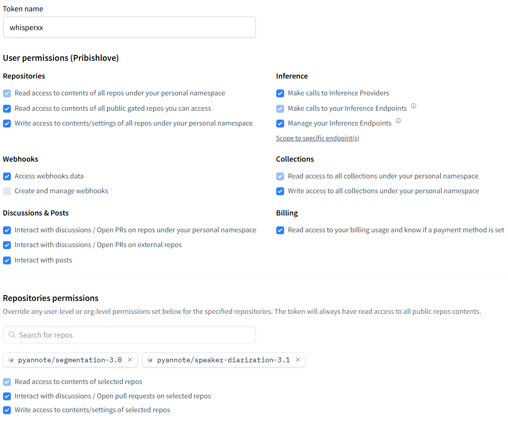
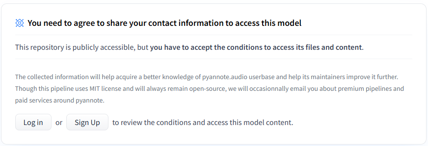

# Установка и запуск проекта

## 1️⃣ Создайте виртуальное окружение
```sh
python -m venv venv
```

## 2️⃣ Активируйте виртуальное окружение
**Windows:**
```sh
source venv/Scripts/activate
```
**Linux/Mac:**
```sh
source venv/bin/activate
```


## 3️⃣ Установите зависимости
```sh
pip install torch torchvision torchaudio --index-url https://download.pytorch.org/whl/cu121  # Для GPU
```
```sh
pip install git+https://github.com/m-bain/whisperX.git
```
```sh
pip install numpy torchaudio transformers ffmpeg-python silero-vad
```

**Если у вас нет видеокарты NVIDIA, замените команду установки Torch на:**
```sh
pip install torch torchvision torchaudio
```

---

## Авторизация на Hugging Face
Перейдите по ссылке и создайте **Access Token**:
🔗 [Hugging Face — Access Tokens](https://huggingface.co/settings/tokens)

⬇ **Пример создания токена:**


После этого найдите в поиске репозитории:
- `pyannote/speaker-diarization-3.1`
- `pyannote/segmentation-3.0`

Дайте доступ, как показано ниже:


### Авторизация в консоли
```sh
huggingface-cli login
```
Add token as git credential? (Y/n) - отвечаем n

После входа замените `HUGGINGFACE_TOKEN` в **transcriber.py** на ваш токен.

---

## Установка NVIDIA GPU Computing Toolkit
🔗 [Скачать CUDA Toolkit](https://developer.nvidia.com/cuda-toolkit)

Установите **CUDA 12.8**.

## Установка cuDNN
1. Авторизуйтесь на сайте **NVIDIA**
2. Перейдите в раздел архива и скачайте **cuDNN v8.9.6**:
   🔗 [Скачать cuDNN v8.9.6](https://developer.nvidia.com/rdp/cudnn-archive)

3. Распакуйте архив и скопируйте файлы в соответствующие папки:

| Папка в архиве | Куда скопировать |
|---------------|----------------|
| **bin/** | `C:\Program Files\NVIDIA GPU Computing Toolkit\CUDA\v12.8\bin` |
| **lib/** | `C:\Program Files\NVIDIA GPU Computing Toolkit\CUDA\v12.8\lib\x64` |
| **include/** | `C:\Program Files\NVIDIA GPU Computing Toolkit\CUDA\v12.8\include` |

---

## Добавление аудиофайла
Скопируйте аудиофайл в рабочую папку и укажите его название в коде **transcriber.py**.

---

## Запуск проекта
```sh
python transcriber.py
```

